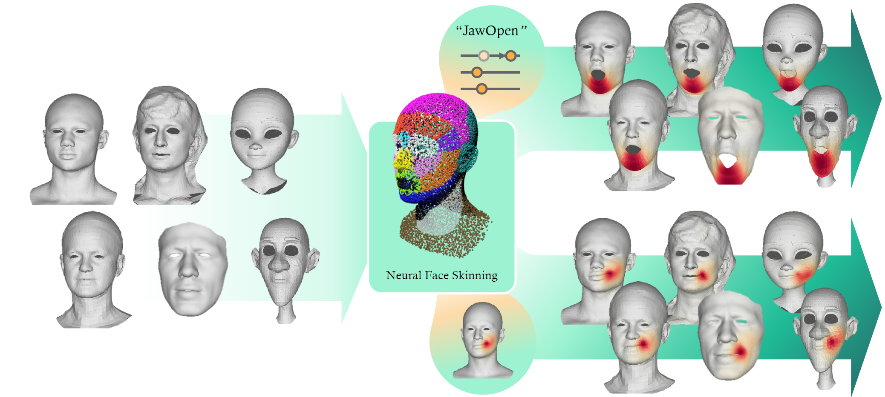

# Neural Face Skinning for Mesh-agnostic Facial Expression Cloning

 
<!-- <a href="">.svg" height=22.5></a> -->
<a href="https://chacorp.github.io/nfs-page/"></a>

This is official implementation of the paper 'Neural Face Skinning for Mesh-agnostic Facial Expression Cloning'

## TODOs
- [x] Installation
- [x] Inference
- [x] Train code
- [ ] Clean up utils
- [ ] Dataloader for custom data
    - [x] preparation code `utils/data_prepare.py`
    - [ ] custom data loader
- [ ] Evaluation
- [ ] Pretrained model
    - [x] trained on ICT & Multiface (no data augmentation)
    - [ ] trained on ICT & Multiface (with data augmentation)


## 1. Installation
### Environment
- System requirement:
    - [x] Ubuntu 20.04, Cuda 11.8
    - [ ] Ubuntu 22.04, Cuda 12.1 (working in progress)
- Tested GPU: NVIDIA-RTX-A5000

Use docker image as below

```bash
docker pull chacorp/audio2face:1.0 # if cuda 11.8
#docker pull chacorp/diff3f:latest # if cuda 12.1 (working in progress)
```

All dependencies for the environment are provided in `requirements.txt`.
```bash
bash setup.sh -m 1 # if cuda 11.8
# bash setup.sh -m 2 # if cuda 12.1 (working in progress)
```
<!-- ```bash
pip install -r requirements.txt
# pip install -r requirements-cuda12.1.txt ## if using chacorp/diff3f:latest, use this
``` -->

### Downloads
Download the following files from the link and place them in the root directory of this repo.
- [ICT files](https://drive.google.com/file/d/1NeSJyVgybzZS-p6uHafv6e3Tv8jTxbCy/view?usp=sharing) \
Place them in the root directory of this repo.
- [NFR files](https://drive.google.com/file/d/1cXXeU3AtpoGEVz2mhlWTSG1dEbAtCmD1/view?usp=sharing) \
Place them in the root directory of this repo.

### Pretrained model
- [checkpoint](https://drive.google.com/drive/folders/16F5JH6b4-pQuxqImYpmDvnbUy8iigPsE?usp=sharing): model trained on ICT and Multiface \
Place the folder in the root directory of this repo.

```text
NFS/
  ├─ assets/
  ├─ ckpts/           # checkpoint folder
  │
  ├─ ict_face_pt/     # ICT files
  │  ├─ exp_basis.pt
  │  ├─ id_basis.pt
  │  ├─ neutral_verts.pt
  │  ├─ quad_faces.pt
  │  └─ random_expression_vecs.npy
  │
  ├─ data/           # NFR files
  ├─ experiments/    # NFR files
  ├─ test-mesh/      # NFR files
  └─ third_party/    # NFR files
     ├─ diffusion-net
     ├─ ICT-FaceKit
     └─ mesh_signatures
```


## 2. Data preparation
### Processing data
To train model, data needs to be pre-processed. \
First, align your mesh to the examples in blender via the `align.blend` file provided from [NFR](https://github.com/dafei-qin/NFR_pytorch).

After the mesh alignment, use `utils/data_prepare.py` to obtain the gradient operator and precomputes for DiffusionNet (mass, Laplacian, spatial gradients, eigenbases ...) for the mesh.

※Note※ \
you only need to process the neutral face of the mesh! no need to process all expression meshes.

```bash
python utils/data_prepare.py \
  -i ${path_to_your_neutral_mesh} \
  -o ${path_to_processed_data}
```

The input and output directory would look like this:
```bash
${path_to_your_neutral_mesh}/
  └─ m00.obj            # aligned mesh using `align.blend`

${path_to_processed_data}/
  ├─ m00_dfn_info.pkl   # precomputes for DiffusionNet
  ├─ m00_img.npy        # rendered image
  ├─ m00_mesh.obj       # processed mesh
  └─ m00_operators.pkl  # gradient operator
```

### Dataloader
TBD ...


## 3. Inference
We provide a jupyter notebook for the inference. `notebook/NFS_inference.ipynb`. \
We also provide a jupyter notebook for NFR inference. `notebook/NFR_inference.ipynb`
NOTE: requres pretrained model... will be uploaded soon... !

## 4. Training
After the data preparation, you can train your own model by using bash file `train.sh` as below:
```bash
bash train.sh
```

The bash file can be modified for desired cases.
```shell
# train model from the scratch
python train.py \
  --log_dir "ckpts" \
  --max_epoch 500 \
  --stage1 --tb \
  --dec_type 'disp' \ 
  --design 'new2' \
  --seg_dim 20 \
  --warmup \
  --window_size 16

# continue or fine-tune model from the saved checkpoint
python train.py \
  --log_dir "ckpts" \
  --max_epoch 500 \
  --stage1 --tb \
  --dec_type 'disp' \
  --design 'new2' \
  --seg_dim 20 \
  --window_size 16 \
  --ckpt "ckpts/2025-01-02-06-54-46-all" # path to saved checkpoint
```


## 5. Evaluation
TBD ... 


## Acknowledgement
We extend our gratitude to the contributors of [NFR](https://github.com/dafei-qin/NFR_pytorch), [CodeTalker](https://github.com/Doubiiu/CodeTalker), [FaceFormer](https://github.com/EvelynFan/FaceFormer), and [Diffusion-Net](https://github.com/nmwsharp/diffusion-net) for their open research.  

We also thank the contributors of [ICT](https://github.com/ICT-VGL/ICT-FaceKit), [Multiface](https://github.com/facebookresearch/multiface), [VOCA](https://voca.is.tue.mpg.de/), and [BIWI](https://data.vision.ee.ethz.ch/cvl/datasets/b3dac2.en.html) for making their data publicly available.  

Additionally, we appreciate the creators of [Mery](https://www.meryproject.com), [Malcolm](https://www.animschool.com), [Piers](https://www.cgtrader.com/free-3d-models/character/man/maya-character-rig-piers-3d-rig), [Morphy](http://www.joshburton.com/projects/morpheus.asp), and [Bonnie](https://www.joshsobelrigs.com/).  

    
<!-- ## Citation
TBD ... -->
